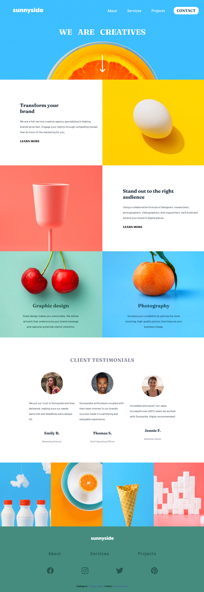

# Frontend Mentor - Sunnyside agency landing page solution

This is a solution to the [Sunnyside agency landing page challenge on Frontend Mentor](https://www.frontendmentor.io/challenges/sunnyside-agency-landing-page-7yVs3B6ef). Frontend Mentor challenges help you improve your coding skills by building realistic projects.

Users should be able to:

- View the optimal layout for the site depending on their device's screen size
- See hover states for all interactive elements on the page

### Screenshot

### Links

- Solution URL: [Solution code URL ](https://github.com/AngwenyiOgata/Sunny-side-challenge.git)
- Live Site URL: [Live site URL](https://angwenyiogata.github.io/Sunny-side-challenge/)

## My process

### Built with

- Semantic HTML5 markup
- CSS custom properties
- Flexbox

### What I learned

using css clip-paths
using html <picture> elements

If you want more help with writing markdown, we'd recommend checking out [The Markdown Guide](https://www.markdownguide.org/) to learn more.

### Useful resources

- [How to do clip--path](https://bennettfeely.com/clippy/) - This helped me for generate clip-paths

## Author

- Frontend Mentor - [@yourusername](https://www.frontendmentor.io/profile/yourusername)
